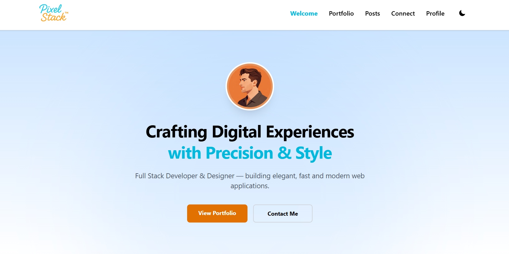
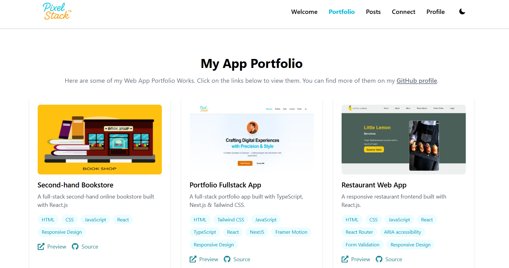
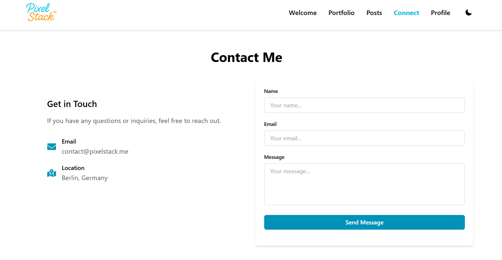
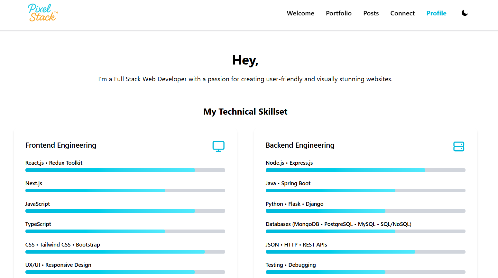
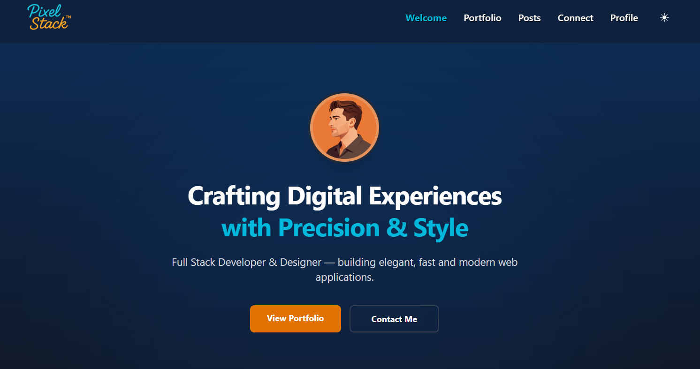

# PixelStack Webfolio

<p align="center">
  
  
  
  
  
  
</p>

This is an animated and responsive portfolio for web apps. It's built with **Next.js**, **TypeScript**, **React**, **Tailwind CSS** and **Framer Motion**.
Features: portfolio showcase, blog system, contact form, profile page and dark/light mode.

## Live Demo

Check out the live demo of the project here:

→ **https://pixelstack-me.vercel.app/**

## Preview / Screenshots

<p align="center">

<br />
<em>Homepage with animated hero section</em>
</p>

<p align="center">

<br />
<em>Portfolio page showcasing projects and tech stack</em>
</p>

<p align="center">

<br />
<em>Contact form with API integration</em>
</p>

<p align="center">

<br />
<em>Profile & skills section with animated progress bars</em>
</p>

<p align="center">

<br />
<em>Dark mode theme using custom ThemeContext</em>
</p>

## Table of Contents

- [Features](#features)
  - [Modern UI & UX](#modern-ui--ux)
  - [Components & Pages](#components--pages)
  - [Tech Stack](#tech-stack)
- [Project Structure](#project-structure)
- [Installation & Setup](#installation--setup)
- [Contact Form](#contact-form)
- [Dark Mode](#dark-mode)
- [License](#license)
- [Testing Setup](#testing-setup)
  - [Installation](#installation)
    - [Install test dependencies](#install-test-dependencies)
    - [Add test scripts to packagejson](#add-test-scripts-to-packagejson)
    - [Install Playwright browser](#install-playwright-browser)
  - [Running Tests](#running-tests)
  - [Explanation of All Tests](#explanation-of-all-tests)
    - [Unit Tests](#unit-tests)
    - [API Tests](#api-tests)
    - [E2E Tests](#e2e-tests)
  - [Test Results Summary](#test-results-summary)

## Features

### Modern UI & UX

- Fully responsive layout
- Smooth Framer Motion animations
- Light/Dark mode with custom ThemeContext
- Clean typography and polished visual design

### Components & Pages

- **Hero section** with animated intro
- **Portfolio** with project previews, tech stack, and live links
- **Blog system** with dynamic routes (`/posts/[handle]`)
- **Contact form** with API route (`/api/contact`)
- **Mobile navigation** with hamburger menu
- **Footer** with social links and branding

### Tech Stack

- **Next.js (App Router)**
- **React.js**
- **TypeScript**
- **Tailwind CSS**
- **Framer Motion**
- **Heroicons & React Icons**

## Project Structure

```text
📁 project-root
│
├── 📂 src                              # Main source folder
│   │
│   ├── 📂 app                           # Next.js App Router – pages & server routes
│   │   │
│   │   ├── 📂 connect                   # "Contact Me" page
│   │   │   └── 📄 page.tsx
│   │   │
│   │   ├── 📂 components                # Reusable UI components
│   │   │   │
│   │   │   ├── 📂 Connect               # Contact form components
│   │   │   │   ├── 📄 ConnectForm.tsx
│   │   │   │   └── 📄 useConnectForm.ts
│   │   │   │
│   │   │   ├── 📂 Footer                # Footer with social links
│   │   │   │   ├── 📄 Footer.tsx
│   │   │   │   ├── 📄 FooterLogo.tsx
│   │   │   │   └── 📄 FooterSocialLinks.tsx
│   │   │   │
│   │   │   ├── 📂 Header                # Header with theme toggle & mobile menu
│   │   │   │   ├── 📄 HeaderNav.tsx
│   │   │   │   ├── 📄 MobileMenu.tsx
│   │   │   │   └── 📄 ThemeSwitchButton.tsx
│   │   │   │
│   │   │   ├── 📂 Home                  # Homepage sections
│   │   │   │   ├── 📂 InfoMail          # Newsletter components
│   │   │   │   │   ├── 📄 InfoMail.tsx
│   │   │   │   │   └── 📄 useMailStatus.ts
│   │   │   │   ├── 📄 Intro.tsx
│   │   │   │   ├── 📄 Portfolio.tsx
│   │   │   │   └── 📄 Posts.tsx
│   │   │   │
│   │   │   ├── 📂 MessageUI             # Error & success messages
│   │   │   │   ├── 📄 ErrorMessage.tsx
│   │   │   │   └── 📄 SuccessMessage.tsx
│   │   │   │
│   │   │   └── 📂 Profile               # About me components
│   │   │       ├── 📄 EducationCard.tsx
│   │   │       ├── 📄 SkillBar.tsx
│   │   │       └── 📄 SkillSection.tsx
│   │   │
│   │   ├── 📂 portfolio                 # Portfolio overview page
│   │   │   └── 📄 page.tsx
│   │   │
│   │   ├── 📂 posts                     # Blog system
│   │   │   ├── 📂 [handle]              # Dynamic blog post route
│   │   │   │   └── 📄 page.tsx
│   │   │   └── 📄 page.tsx              # Blog index page
│   │   │
│   │   ├── 📂 profile                   # Profile / About Me page
│   │   │   └── 📄 page.tsx
│   │   │
│   │   ├── 📂 api                       # Serverless API routes
│   │   │   └── 📂 connect               # Contact form backend endpoint
│   │   │       └── 📄 route.ts
│   │   │
│   │   ├── 📂 context
│   │   │   └── 📄 ThemeContext.tsx      # Custom theme logic
│   │   │
│   │   ├── 📄 layout.tsx                # Root layout (header, footer, providers)
│   │   ├── 📄 globals.css               # Global Tailwind styles
│   │   └── 📄 page.tsx                  # Homepage
│   │
│   ├── 📂 data                          # Static content
│   │   ├── 📂 content                   # Blog post details
│   │   │   └── 📄 post-details.tsx
│   │   ├── 📄 posts.ts                  # Blog metadata
│   │   └── 📄 portfolio.ts              # Portfolio metadata
│   │
│   └── 📂 types                         # Shared TypeScript types
│       └── 📄 index.ts
│
├── 📂 tests                             # Unit & API Tests
│   ├── 📄 useConnectForm.test.ts        # Hook tests
│   └── 📄 api-connect.test.ts           # API route tests
│
├── 📂 e2e                               # Playwright E2E browser tests
│   └── 📄 contact-form.e2e.spec.ts      # Contact form E2E test
│
├── 📂 public                            # Static assets
│   ├── 📂 avatars
│   ├── 📂 logos
│   ├── 📂 portfolio-img
│   └── 📂 icons
│
├── 📄 jest.config.ts                    # Jest configuration
├── 📄 jest.setup.ts                     # Jest setup (polyfills, mocks)
├── 📄 playwright.config.ts              # Playwright configuration
├── 📄 .gitignore
├── 📄 README.md
├── 📄 package.json
└── 📄 tsconfig.json
```

## Installation & Setup

```bash
git clone https://github.com/source-code-examples/pixelstack.git
cd pixelstack
npm install
npm run dev
```

The app will be available at: http://localhost:4000

## Contact Form

The contact form sends requests to: POST /api/connect
The API validates the input and returns a JSON response.

## Dark Mode

Dark mode is handled through a custom ThemeContext:

- Saves preference in localStorage
- Detects system theme
- Avoids FOUC with a mounted-state check
- Instant theme switching

## License

This project is private and serves as a personal portfolio.

# Testing Setup

## Installation

### Install test dependencies

```bash
npm install --save-dev jest jest-environment-jsdom whatwg-fetch @testing-library/jest-dom @testing-library/react @types/jest
```

### Add test scripts to package.json

```bash
"scripts": {
  "test": "jest --watch",
  "test:run": "jest",
  "test:coverage": "jest --coverage",
  "test:e2e": "playwright test"
}
```

### Install Playwright browser

```bash
npx playwright install chromium
```

## Running Tests

```bash
# Unit & API Tests (Watch Mode)
npm test

# Single test run
npm run test:run

# Coverage report
npm run test:coverage

# E2E browser tests
npm run test:e2e
```

## Explanation of All Tests

### Unit Tests

**File:** `tests/useConnectForm.test.ts`

- **Starts with an empty form** – Hook initializes with empty fields
- **Can update name** – Name input updates state
- **Can update email** – Email input updates state
- **Can submit form** – Submit handler is triggered correctl

**Purpose:** Ensures the core hook logic works as expected.

### API Tests

**File:** `tests/useConnectForm.test.ts`

- **Accepts valid data** – API returns success for correct input
- **Rejects empty fields** – Validation prevents empty submissions
- **Rejects invalid email** – Email format is validated

**Purpose:** Verifies backend validation and error handling.

### E2E Tests

**File:** `e2e/contact-form.e2e.spec.ts`

- **Displays the form** – Page loads and form is visible
- **Can submit the form** – Full happy‑path submission works
- **Validates empty form** – Browser prevents empty submission

**Purpose:** Tests the real user flow in the browser.

## Test Results Summary

**Total: 10 tests**

- [ ] 4 Unit Tests (hook logic)
- [ ] 3 API Tests (backend validation)
- [ ] 3 E2E Tests (browser flow)
- [ ] `npm test` → 7 passing tests (Unit + API)
- [ ] `npm run test:e2e` → 3 passing tests
- [ ] All 10 tests pass successfully
